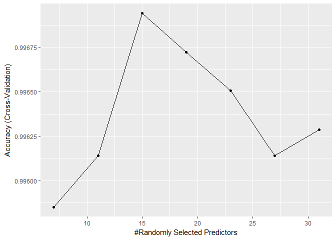
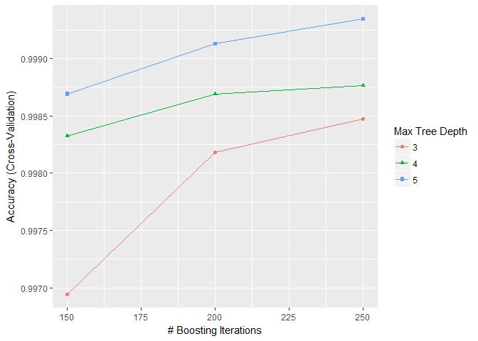
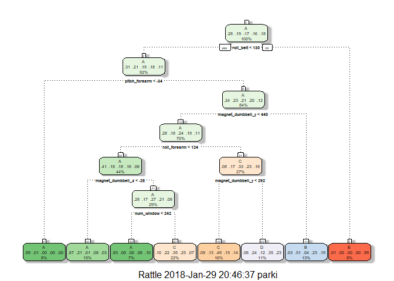

## Introduction

Using devices such as Jawbone Up, Nike FuelBand, and Fitbit it is now possible to collect a large amount of data about personal activity relatively inexpensively. These type of devices are part of the quantified self movement – a group of enthusiasts who take measurements about themselves regularly to improve their health, to find patterns in their behavior, or because they are tech geeks. One thing that people regularly do is quantify how much of a particular activity they do, but they rarely quantify how well they do it. In this project, your goal will be to use data from accelerometers on the belt, forearm, arm, and dumbell of 6 participants. They were asked to perform barbell lifts correctly and incorrectly in 5 different ways. More information is available from the website [here](http://web.archive.org/web/20161224072740/http:/groupware.les.inf.puc-rio.br/har) (see the section on the Weight Lifting Exercise Dataset).

The data for this project came from this [source](http://web.archive.org/web/20161224072740/http:/groupware.les.inf.puc-rio.br/har)

This report will show how the data was cleaned, processed, and manipulated in order to predict the five different exercises. The project will mainly focus on 'Classification and Regression Trees', 'Random Forest', and 'Stochastic Gradient Boosting' using the `caret` package in R.

## Data Processing

No preprocessing occurs outside of this document. Data processing and analysis was conducted using R (Version 3.43) on RStudio (Version 1.0.44) with Windows 10 x64.

### Loading libraries


```r
library(caret)          #Version 6.0.78
library(data.table)     #Version 1.10.4.3
library(parallel)       #Version 3.4.3
library(doParallel)     #Version 1.0.11
library(rattle)         #Version 5.1.0
library(printr)         #Version 0.1
```

### Downloading and loading data

If necessary the data is downloaded from the source URL, and read into a `data.table`.


```r
url_train <- "https://d396qusza40orc.cloudfront.net/predmachlearn/pml-training.csv"
url_test <- "https://d396qusza40orc.cloudfront.net/predmachlearn/pml-testing.csv"

if (!file.exists("pml-training.csv")) {
    download.file(url_train, destfile = "pml-training.csv")  
}
if (!file.exists("pml-testing.csv")) {
    download.file(url_test, destfile = "pml-testing.csv")
}

train_original <- fread("pml-training.csv")
test_orginal <- fread("pml-testing.csv")
```

### Cleaning data

After viewing the data by `View(train_original)` the following first five columns are removed `V1`, `user_name`, `raw_timestamp_part_1`, `raw_timestamp_part_2`, and `cvtd_timestamp`. These five columns will have no benefit if included in a prediction algorithm, the model would fit this data and would not be able to generalize to new data. All data cleaning done on training will also be done to the testing data.


```r
dim(train_original)
```

```
## [1] 19622   160
```

```r
training <- train_original[, -c(1:5)]
testing <- test_orginal[, -c(1:5)]
```

Further analysis shows that the data has a lot of missing values and has very low variance in a lot of the columns. Removing all the columns that have near zero variance or the columns that have 95% of the data missing will help speed up the algorithms like 'Random Forest', and also help generalize better to new data by not fitting the model to 'noise'. Finally checking to see if any NA's remain.


```r
near_zv <- nearZeroVar(training, saveMetrics = TRUE)
index <- !near_zv$nzv
training <- training[, ..index]
testing <- testing[, ..index]

high_na_cols <- apply(training, 2, function(x) mean(!is.na(x)) >= 0.95)
training <- training[, ..high_na_cols]
testing <- testing[, ..high_na_cols]

remaining_NAs <- sum(apply(training, 2, function(x) mean(!is.na(x)) != 1))
print(paste("Number of columns with NA's: ", remaining_NAs))
```

```
## [1] "Number of columns with NA's:  0"
```

## Model Fitting

Setting the seed for reproducibility. Splitting the `training` data into a `validation` and a `training` set.


```r
set.seed(425)
in_train <- createDataPartition(training$classe, p =0.7, list = FALSE)
validation <- training[-in_train, ]
training <- training[in_train, ]
cat(paste0("Training Dimensions: ", dim(training)[1], " x ", dim(training)[2],
           "\nValidation Dimensions: ", dim(validation)[1], " x ", dim(validation)[2],
           "\nTesting Dimensions: ", dim(testing)[1], " x ", dim(testing)[2]))
```

```
## Training Dimensions: 13737 x 54
## Validation Dimensions: 5885 x 54
## Testing Dimensions: 20 x 54
```

### Random Forest (rf)

Fitting a random forest with different number of predictors sampled for splitting at each node. Using '5-fold' cross validation to determine best fit. Preprocessing data by centering and scaling.


```r
cluster <- makeCluster(detectCores() - 1)
registerDoParallel(cluster)
rf_control <- trainControl(method = "cv", number = 5)
rf_grid <- expand.grid(.mtry=seq(7,31,4))
rf_model <- train(classe~., data = training,
                  method = "rf", 
                  preProcess = c("center","scale"),
                  tuneGrid = rf_grid,
                  trControl = rf_control)
stopCluster(cluster)
registerDoSEQ()
ggplot(rf_model)
```

<!-- -->

### Stochastic Gradient Boosting (gbm)

Fitting a 'gbm' model or (Stochastic Gradient Boosting) again using '5-fold' cross validation. Since this model has four hyper-parameters. The default value for 'gbm' was used, and then a grid-search with the following values was used to gain a better model.


```r
gbm_control <- trainControl(method = "cv", number = 5)

gbm_grid <- expand.grid(interaction.depth = c(3,4,5),
                        n.trees = c(150,200,250),
                        shrinkage = .2,
                        n.minobsinnode = 10)

gbm_model <- train(classe~., data = training,
                     method = "gbm",
                     trControl = gbm_control,
                     preProcess = c("center","scale"),
                     tuneGrid = gbm_grid,
                     verbose = FALSE)
ggplot(gbm_model)
```

<!-- -->

### Classification and Regression Trees (rpart)

The best part about fitting decision trees is their easy interpretability. The data will not be scaled or centered for easier understanding. Complexity parameter will be adjusted for best results, not just considering accuracy but also readability. The model will be plotted using the `rattle` package.


```r
rpart_control <- trainControl(method = "cv", number = 5)
rpart_grid <-  expand.grid(.cp = 0.035)

rpart_model <- train(classe~., data = training,
                     method = "rpart",
                     trControl = rpart_control,
                     tuneGrid = rpart_grid)

fancyRpartPlot(rpart_model$finalModel)
```

<!-- -->
 
## Evalutation

Predicting results for validation set and then creating confusion matrix for each model. Viewing each models results for accuracy, sensitivity, and specificity. Predicting results for the testing set to compare. On the 'GBM' and 'Random Forest' models the best accuracy on the cross validation was selected for each model. The 'Decision Tree' model could of had higher accuracy, but the number of branches was becoming uninterpretable, so a lower complexity parameter was selected, thus resulting in lower accuracy.


```r
rf_pred_val <- predict(rf_model, validation)
rf_conf_val <- confusionMatrix(validation$classe, rf_pred_val)
gbm_pred_val <- predict(gbm_model, validation)
gbm_conf_val <- confusionMatrix(validation$classe, gbm_pred_val)
rpart_pred_val <- predict(rpart_model, validation)
rpart_conf_val <- confusionMatrix(validation$classe, rpart_pred_val)
rf_pred_test <- predict(rf_model, testing)
gbm_pred_test <- predict(gbm_model, testing)
rpart_pred_test <- predict(rpart_model, testing)
rf_conf_val
```

```
## Confusion Matrix and Statistics
## 
##           Reference
## Prediction    A    B    C    D    E
##          A 1673    1    0    0    0
##          B    2 1136    1    0    0
##          C    0    3 1023    0    0
##          D    0    0    1  963    0
##          E    0    0    0    1 1081
## 
## Overall Statistics
##                                           
##                Accuracy : 0.9985          
##                  95% CI : (0.9971, 0.9993)
##     No Information Rate : 0.2846          
##     P-Value [Acc > NIR] : < 2.2e-16       
##                                           
##                   Kappa : 0.9981          
##  Mcnemar's Test P-Value : NA              
## 
## Statistics by Class:
## 
##                      Class: A Class: B Class: C Class: D Class: E
## Sensitivity            0.9988   0.9965   0.9980   0.9990   1.0000
## Specificity            0.9998   0.9994   0.9994   0.9998   0.9998
## Pos Pred Value         0.9994   0.9974   0.9971   0.9990   0.9991
## Neg Pred Value         0.9995   0.9992   0.9996   0.9998   1.0000
## Prevalence             0.2846   0.1937   0.1742   0.1638   0.1837
## Detection Rate         0.2843   0.1930   0.1738   0.1636   0.1837
## Detection Prevalence   0.2845   0.1935   0.1743   0.1638   0.1839
## Balanced Accuracy      0.9993   0.9979   0.9987   0.9994   0.9999
```

```r
gbm_conf_val
```

```
## Confusion Matrix and Statistics
## 
##           Reference
## Prediction    A    B    C    D    E
##          A 1674    0    0    0    0
##          B    1 1138    0    0    0
##          C    0    0 1024    2    0
##          D    0    0    0  964    0
##          E    0    0    0    2 1080
## 
## Overall Statistics
##                                          
##                Accuracy : 0.9992         
##                  95% CI : (0.998, 0.9997)
##     No Information Rate : 0.2846         
##     P-Value [Acc > NIR] : < 2.2e-16      
##                                          
##                   Kappa : 0.9989         
##  Mcnemar's Test P-Value : NA             
## 
## Statistics by Class:
## 
##                      Class: A Class: B Class: C Class: D Class: E
## Sensitivity            0.9994   1.0000   1.0000   0.9959   1.0000
## Specificity            1.0000   0.9998   0.9996   1.0000   0.9996
## Pos Pred Value         1.0000   0.9991   0.9981   1.0000   0.9982
## Neg Pred Value         0.9998   1.0000   1.0000   0.9992   1.0000
## Prevalence             0.2846   0.1934   0.1740   0.1645   0.1835
## Detection Rate         0.2845   0.1934   0.1740   0.1638   0.1835
## Detection Prevalence   0.2845   0.1935   0.1743   0.1638   0.1839
## Balanced Accuracy      0.9997   0.9999   0.9998   0.9979   0.9998
```

```r
rpart_conf_val
```

```
## Confusion Matrix and Statistics
## 
##           Reference
## Prediction    A    B    C    D    E
##          A 1393   21  221   35    4
##          B  205  373  400  161    0
##          C    8   35  912   71    0
##          D   95  157  498  214    0
##          E   66  147  213  175  481
## 
## Overall Statistics
##                                           
##                Accuracy : 0.5732          
##                  95% CI : (0.5604, 0.5858)
##     No Information Rate : 0.3813          
##     P-Value [Acc > NIR] : < 2.2e-16       
##                                           
##                   Kappa : 0.4601          
##  Mcnemar's Test P-Value : < 2.2e-16       
## 
## Statistics by Class:
## 
##                      Class: A Class: B Class: C Class: D Class: E
## Sensitivity            0.7883  0.50887   0.4064  0.32622  0.99175
## Specificity            0.9318  0.85132   0.9687  0.85657  0.88870
## Pos Pred Value         0.8321  0.32748   0.8889  0.22199  0.44455
## Neg Pred Value         0.9112  0.92415   0.7259  0.91018  0.99917
## Prevalence             0.3003  0.12455   0.3813  0.11147  0.08241
## Detection Rate         0.2367  0.06338   0.1550  0.03636  0.08173
## Detection Prevalence   0.2845  0.19354   0.1743  0.16381  0.18386
## Balanced Accuracy      0.8601  0.68009   0.6876  0.59139  0.94023
```

## Final Results

The `Random Forest` and `GBM` had very similar cross validation accuracies, and everything checks out with the confusion matrix. The out of sample error rate for each was very small as can be seen below.


```r
out_error_rf <- (1 - rf_conf_val$overall[["Accuracy"]])*100
out_error_gbm <- (1 - gbm_conf_val$overall[["Accuracy"]])*100
cat(paste0("OUT OF SAMPLE ERROR \n",
           " Random Forest: ", round(out_error_rf,2), "% \n",
           " GBM: ", round(out_error_gbm,2), "%"))
```

```
## OUT OF SAMPLE ERROR 
##  Random Forest: 0.15% 
##  GBM: 0.08%
```

'GBM' has a slightly lower out of sample error than 'Random Forest', but both models have great accuracy. 'Random Forest' training time is about half of 'GBM' for a single model though. The goal of this project was to determine what `classe` the 20 test cases were in, with both models giving low error the results below were identical to each other.


```r
final_results <- t(cbind(as.data.frame(rf_pred_test),as.data.frame(gbm_pred_test)))
final_results <- as.data.frame(final_results)
names(final_results) <- as.character(seq(1,20,1))
row.names(final_results) <- c("Random Forest", "GBM")
final_results
```

                1    2    3    4    5    6    7    8    9    10   11   12   13   14   15   16   17   18   19   20 
--------------  ---  ---  ---  ---  ---  ---  ---  ---  ---  ---  ---  ---  ---  ---  ---  ---  ---  ---  ---  ---
Random Forest   B    A    B    A    A    E    D    B    A    A    B    C    B    A    E    E    A    B    B    B  
GBM             B    A    B    A    A    E    D    B    A    A    B    C    B    A    E    E    A    B    B    B  
